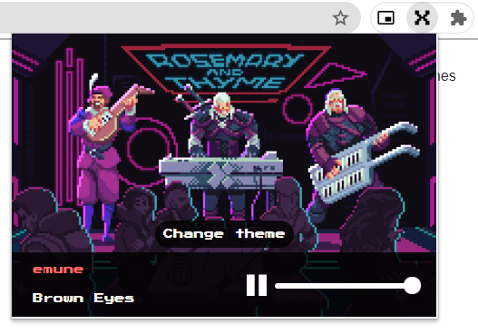
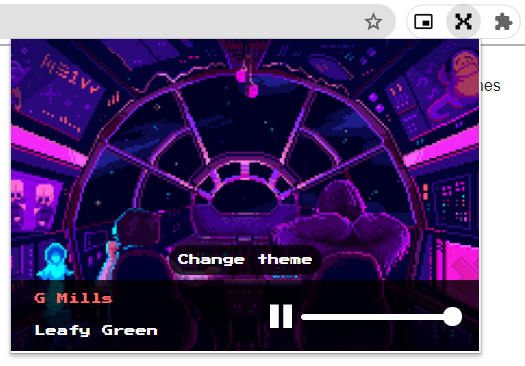
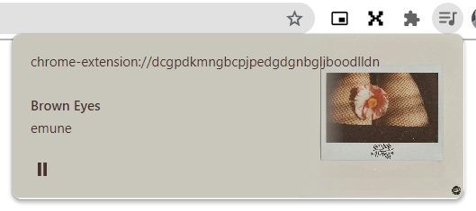
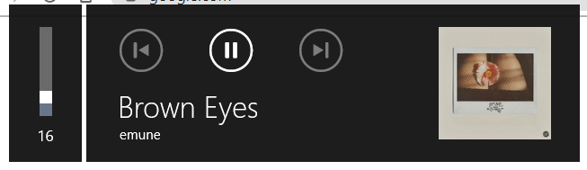

#  Radio X Chrome Extension (Unofficial)
Whenever I'm working in my laptop and need to concentrate I like to listen to any kind of music without lyrics. X-Team Radio is a great page that helps me a lot in those moments. So I made a Chrome extension to quickly access to the radio and avoid having an open tab somewhere in the browser. And that's it, there's no chat, only music.

## Features
- As on the original page, possibility to change the theme (5 included at the moment)
 

- Used MediaSession API to populate multimedia notification

 

## How to install
The extension is not published on Chrome store so:
- Download the source code from github `Code/Download ZIP`
- Extract the downloaded file and put "Radio-X-Chrome-Extension-master" folder in some safe directory of yours
- In Chrome navigate to `chrome://extensions/`
- In upper right edge, toggle `Developer mode` option
- In upper left edge, click on `Load unpacked`
- A new window will appear, navigate to `Radio-X-Chrome-Extension` folder, open it and press `Select folder`
- All done! You can disable Developer mode and also you can pin the extension for a quick access

## Credits
- Theme images and stream audio source belong to [X-Team Radio](https://radio.x-team.com/), all credits to them.
